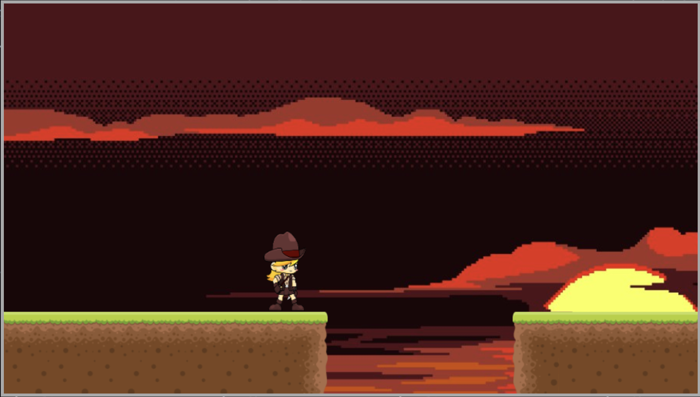

# Alternate Planes

[Link to Game](https://shualaik.github.io/AlternatePlanes/)

Let's set the scene. Your scientist on a distant planet, finding himself in the trecherous situation of being seperated from his ship. The planet is vastly unsafe, but you have an advantage. In your disposal is your plane shifter, capable of shifting you to an alternate reality where obstacles may be passed. So, do you have what it takes to make it back to your ship?

### Controls
- A - Move Left
- D - Move Right
- Q - Change Planes
- SpaceBar - Jump

##GamePlay

Users must find there way through an array of puzzle levels to make it to the otherside. Some parts of the level may only appear in one universe vs the other. User's must use this to their advantage and navigate the level. A slight blue tint is used to differenciate between the two.

For example, these are of the same level:

This was achieved by structuring the level blocks with a 'this.hidden' attribute, set to eitehr '1', '-1', or '0'. The level takes these in as an array and filters out which to show using the following: 

`if ((e.hidden === 0) || e.hidden === this.hidden ) {...}`

`this.hidden` refers to an attribute on the game class that changes between `1` and `-1` whenever the User presses Q.

As far as level structuring goes, it's simple lines of code that build up each block:

`this.level.push(new StillBlock(0, 400, 60, 60, 2, 0));`

The arguments passed in represent:

`X Coordinate`, `Y Coordinate`, `Width`, `Height`, `Tile Image`, `Hidden Valie`

#### In Alternate Planes, users will be able to:
- Navigate levels and advance towards end goal
- Alternate between `realities` to solve challenges
- Have fun :)
#### Technologies:
- Canvas API
- Webpack

# Features to come
- weapons & enemies
- slow time
- more levels

